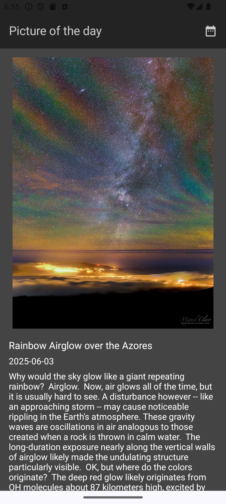

### Overview:

Please add your own NASA API key in `local.properties` as a String i.e.\
`NASA_API_KEY="ThisIsMyKey"`

### Technologies:

`Kotlin`\
`Jetpack Compose`\
`Compose Navigation`\
`Coil`\
`ViewBinding`\
`PierfrancescoSoffritti android-youtube-player`

#### Screenshot

