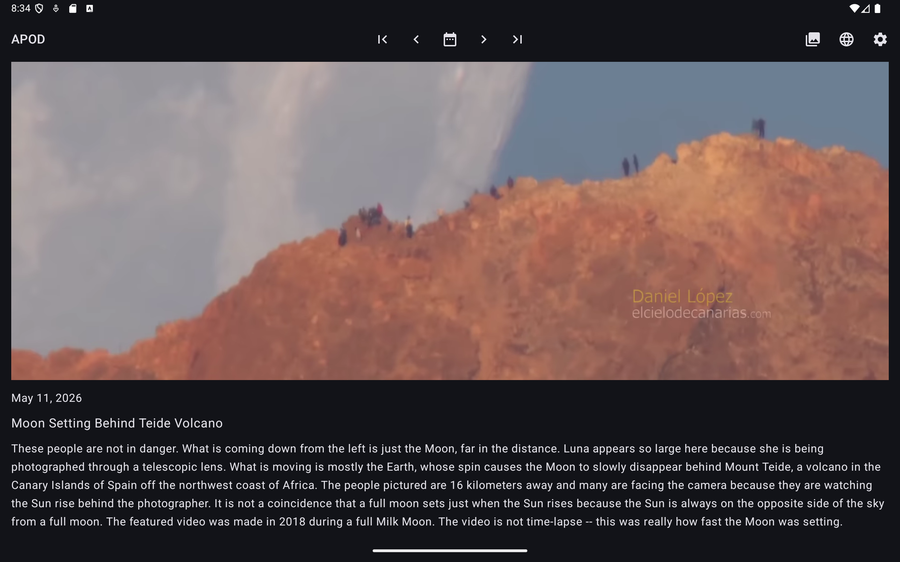

### Overview

- NASA API key is required in `local.properties` i.e. `NASA_API_KEY="ThisIsMyKey"`
- You can obtain a key here https://api.nasa.gov/

### Technologies

- `Kotlin`, `Jetpack Compose`, `Retrofit`
- [android-youtube-player](https://github.com/PierfrancescoSoffritti/android-youtube-player)
- [AndroidX Media](https://github.com/androidx/media)

### Screenshots

